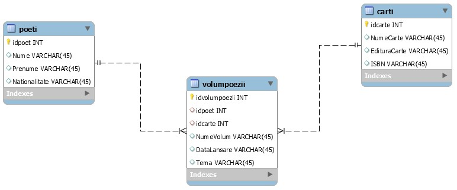
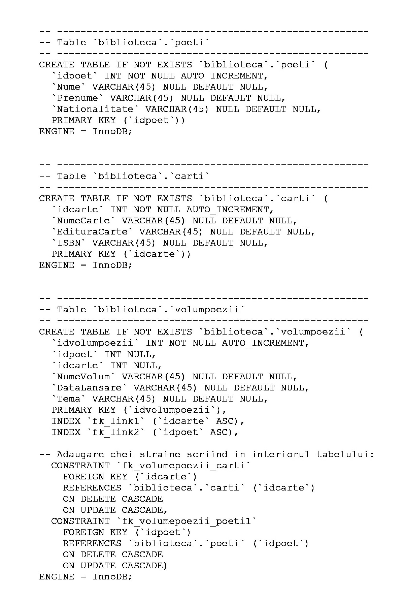
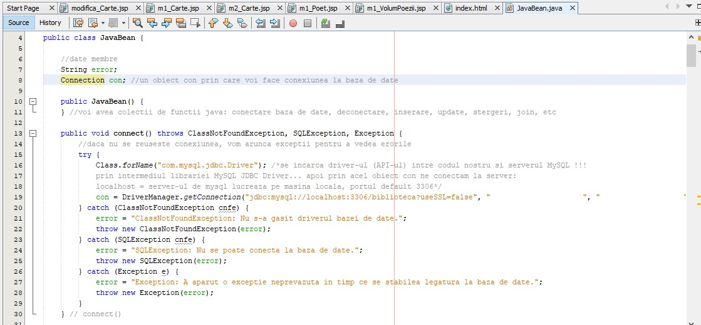
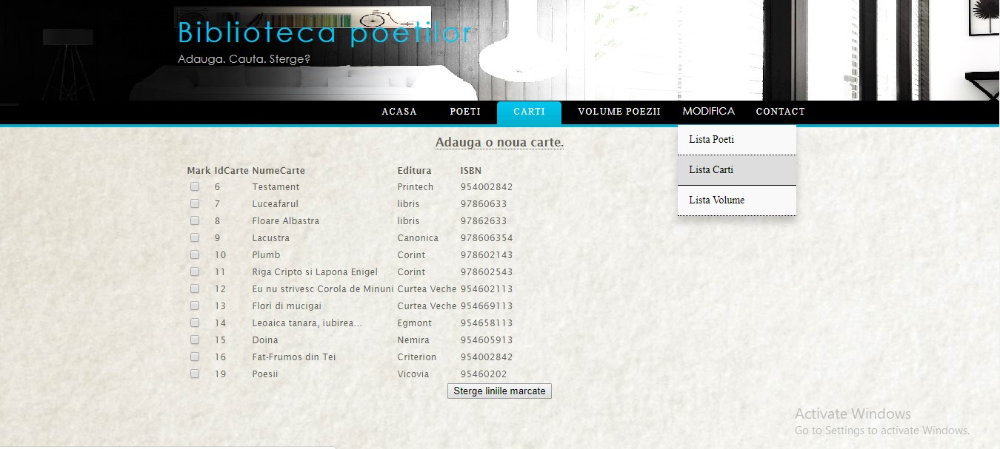
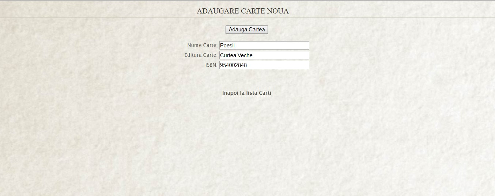
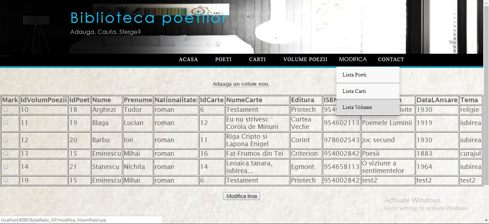
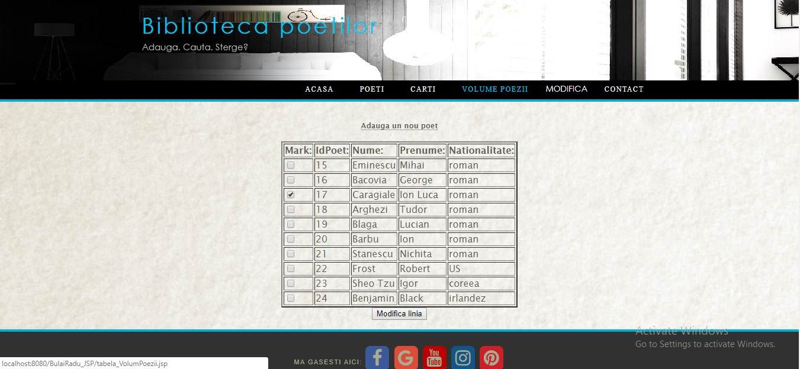

# WebAPI-JSP
Web application containing a database created in MySQL using JSP Technology for interface.

<b>NOTE: 
The Java code (scriptlets in .jsp files) was written by the coordinating teacher. 
In this project I had to make the database (using MySQL), correct and modify the Java code for my specific application & create the web interface (using HTML, JS, CSS).</b>

A database is an organized collection of data, generally stored and electronically accessed from a computer system. 
If databases are more complex, they are often developed using formal design and modeling techniques.

In this project, I had to create a database containing "Poet" and "Books" tables,
the M:N association being made through the "Poetry Volumes" association table.

This diagram can be done either in the MySQL Model environment or by writing the following SQL code:

JSP is a technology that helps software developers create dynamic web pages based on HTML, XML, or other types of documents. Launched in 1999 by Sun Microsystems, JSP is similar to PHP and ASP, but uses the Java programming language.

Here is a sample of main class JavaBean

The final result of this Web Application:

